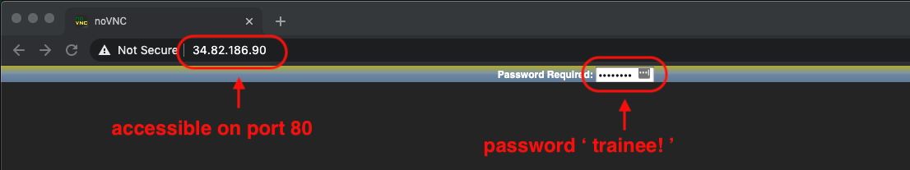
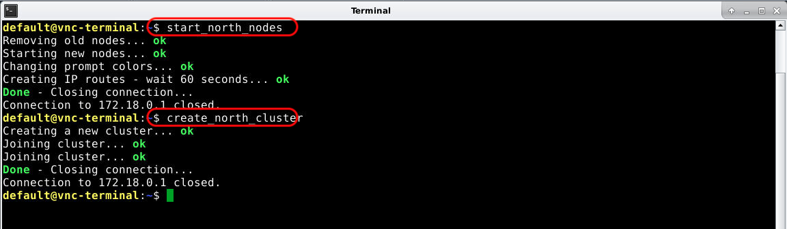
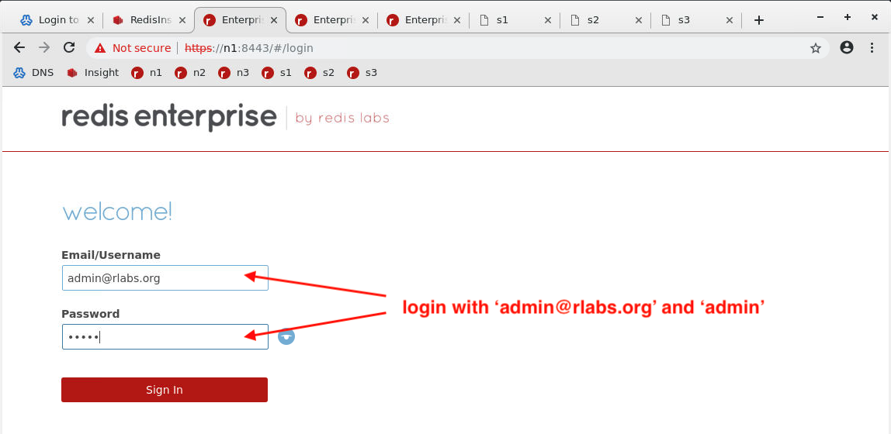
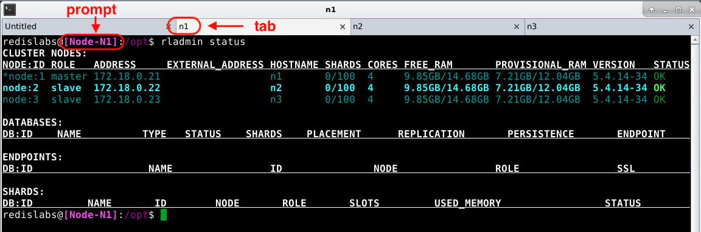
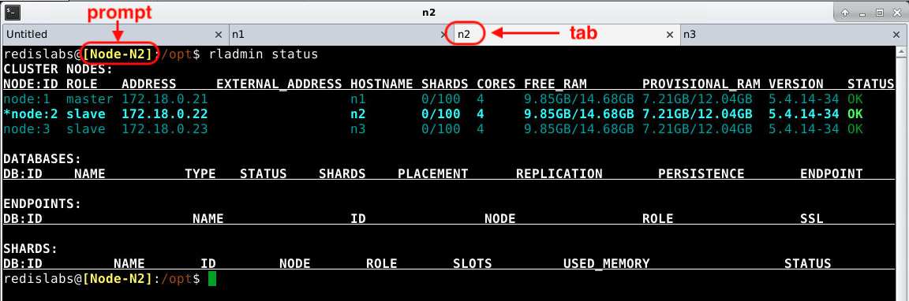
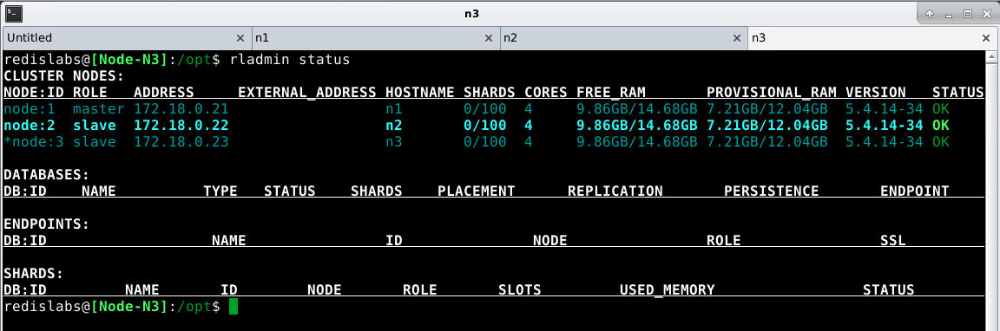
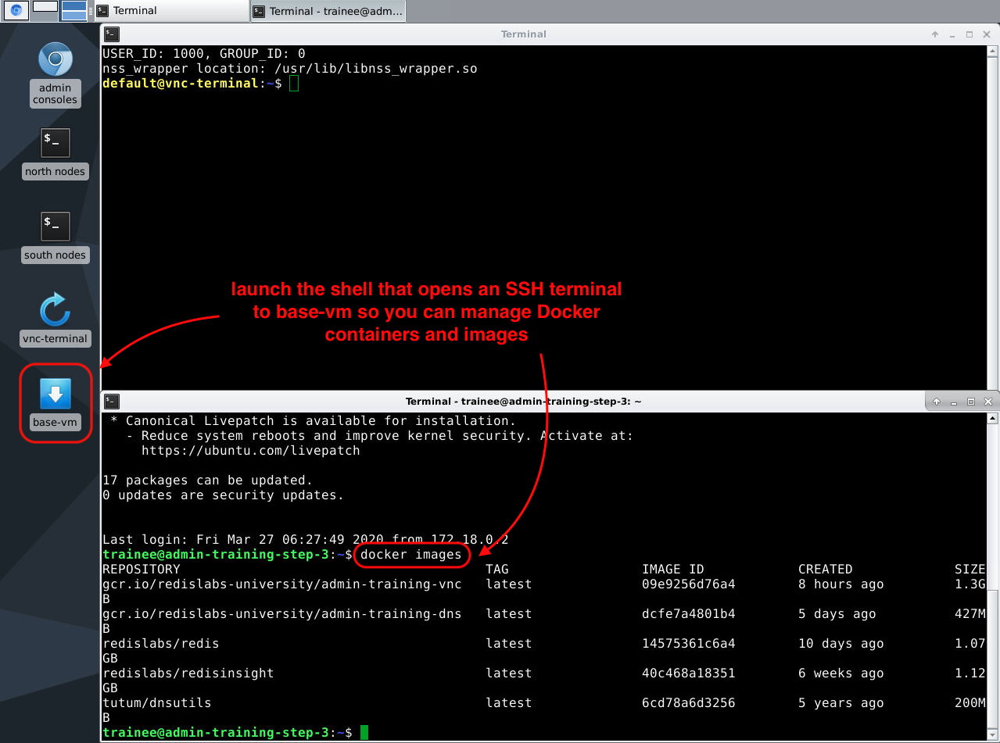

# Overview

A finished VM includes the following. 


Nodes run in containers, but they look like VMs because they have hostnames and IPs.

The DNS server resolves node and cluster names.

## VM Login

All someone needs to use a VM is its public IP and VNC password.



VNC desktop runs on port 80, so organization firewalls should not block it.

You may need to start VMs with specific IP or a hostname, and that's easily doable.

This is what the VNC desktop looks like at sign in.


There are 3 workspaces (i.e. displays) so you can keep lots of windows open and organized.

Launchers (on the left) open windows in specific locations.

If you launch windows on specific workspaces, they won't overlap and all you have to do is switch workspaces to get to everything.

## VNC Terminal - workspace 3

Here's what it looks like when you go to ***workspace 3*** and run ***vnc-terminal***.



In ***vnc-terminal*** you can run commands to start and stop RE nodes and create clusters.

Students run ***start_north_nodes*** to start the 3 north nodes (not clustered).

Students create clusters manually. the ***create_north_cluster*** command is used to re-create the cluster.

## Admin Consoles - workspace 1

Here's what it looks like when you go to ***workspace 1*** and run ***Chrome*** browser.



Students can view the DNS server, Redis Insight, and all 6 node admin consoles.

Tabs open and bookmarks are available.

If nodes are not started, node tabs return errors. If nodes are started, but not clustered, you get the Redis Labs ***Setup*** page.

If nodes are joined in a cluster, you get the Redis Labs ***login*** page (shown above).

To sign-in use ***admin@rlabs.org*** and password ***admin***. These are default cluster credentials used in labs and with the ***create_north_cluster*** command.

## Node terminals - workspace 2

Here's what it looks like when you go to ***workspace 2*** and double click the ***north node CLIs*** or ***south node CLIs*** launchers on the left. North nodes always open in the top half of the screen, south nodes in the bottom half.

Each node gets its own tab and different colored prompt (shown below).

```diff
- Node n1
```


```diff
! Node n2
```


```diff
+ Node n3
```


Tabs are SSH terminals to nodes. If tabs don't open, nodes aren't started. Sometimes one or two tabs won't open even if nodes are started - just re-open the window to get all tabs.

When you shut down nodes in ***vnc-terminal***, with commands like ***stop_n1***, ***stop_n2***, and so on, node tabs close until you restart nodes with commands like ***start_n1***, ***start_n2***, etc.

## Base VM Terminal - workspace 3

Return to ***workspace 3*** and double click ***base VM*** launcher to open the SSH termainal to the base VM.



From here, students install RES software in lab 3.

You can also run Docker commands to inspect the state of nodes, DNS, and Redis Insight (each runs in a container).

Now you're ready to start VMs.

```diff
+ Click Next to continue...
```

# <p align="center">>> [Next](../start-vms) >></p>
