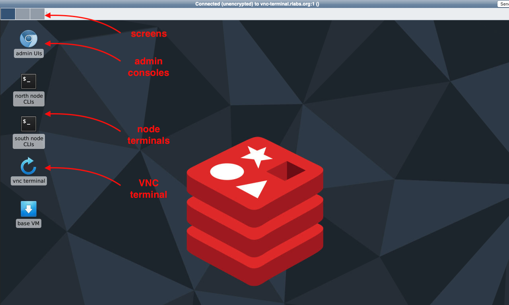

# VM Config - Stage 3

Generate a ***Stage 3*** VM and VNC Docker image.

You have 3 options:
- Create VM and VNC from scratch
- Update VM
- Update VNC.

```diff
! IMPORTANT
```
VM and VNC Docker images share a pair of SSH keys. If you update the VM, you'll be told to copy keys from the VNC Docker image.

Here's what the VNC desktop looks like when done.




## Create VM and VNC From Scratch

1. Create the VM from ***admin-training-2***.

```bash
gcloud compute instances create admin-training-3 --source-instance-template admin-training-2 --zone=us-west1-b
 
```

2. SSH to the VM from GCP console.

### Copy files to the container

Students start and stop nodes from a VNC container terminal. Alias commands allow them to transparently SSH to the base VM and run Docker commands there in a controlled manner.

1. Install SSH on the VNC container.

```bash
sudo docker exec --user root vanilla-vnc bash -c "apt update; apt install -y ssh"
 
```

2. Switch to the ***trainee*** user.

```bash
sudo su - trainee
 
```

3. Generate keys so students can 'silently' SSH from the container.

```bash
mkdir .ssh
ssh-keygen -q -t rsa -N '' -f .ssh/id_rsa 2>/dev/null <<< y >/dev/null
cp -r .ssh/id_rsa.pub .ssh/authorized_keys
 
```

4. Copy keys to the container.

```bash
docker cp .ssh/ vanilla-vnc:/headless
docker exec --user root vanilla-vnc bash -c "chown -R 1000:0 /headless/.ssh/"
 
```

5. Create a new ***.bashrc*** file so students have alias commands.

```bash
cat << EOF > vnc-bashrc
source \$STARTUPDIR/generate_container_user

export PS1='\e[1;33m\u@\h\e[m:\e[1;34m\w\e[m\$ '

alias create_north_cluster="ssh -t trainee@172.18.0.1 ./scripts/create_north_cluster.sh "
alias create_south_cluster="ssh -t trainee@172.18.0.1 ./scripts/create_south_cluster.sh "

alias run_dnsutils="ssh -t trainee@172.18.0.1 ./scripts/run_dnsutils.sh "

alias run_redis_start="ssh -t trainee@172.18.0.1 docker run -it --name redis -h redis -w / redis bash"
alias run_redis_stop="ssh -t trainee@172.18.0.1 docker container rm \$\(docker container ls -q -f '\''status=exited'\''\)"

alias ssh_base-vm="ssh -t trainee@172.18.0.1"        # only used by admins when building VMs

alias start_north_nodes="ssh -t trainee@172.18.0.1 ./scripts/start_north_nodes.sh "
alias start_south_nodes="ssh -t trainee@172.18.0.1 ./scripts/start_south_nodes.sh "

alias start_n1="ssh -t trainee@172.18.0.1 docker start n1 "
alias start_n2="ssh -t trainee@172.18.0.1 docker start n2 "
alias start_n3="ssh -t trainee@172.18.0.1 docker start n3 "
alias start_s1="ssh -t trainee@172.18.0.1 docker start s1 "
alias start_s2="ssh -t trainee@172.18.0.1 docker start s2 "
alias start_s3="ssh -t trainee@172.18.0.1 docker start s3 "

alias stop_n1="ssh -t trainee@172.18.0.1 docker stop n1 "
alias stop_n2="ssh -t trainee@172.18.0.1 docker stop n2 "
alias stop_n3="ssh -t trainee@172.18.0.1 docker stop n3 "
alias stop_s1="ssh -t trainee@172.18.0.1 docker stop s1 "
alias stop_s2="ssh -t trainee@172.18.0.1 docker stop s2 "
alias stop_s3="ssh -t trainee@172.18.0.1 docker stop s3 "
EOF
 
```

6. Copy ***.bashrc*** to the container.

```bash
docker cp vnc-bashrc vanilla-vnc:/headless/.bashrc
docker exec --user root vanilla-vnc bash -c "chown -R 1000:0 /headless/.bashrc"
 
```

7. Download Redis background image from GCS and copy it to the container.

```bash
gsutil cp gs://admin-training-bucket/background-training-classroom.jpg /tmp
docker cp /tmp/background-training-classroom.jpg vanilla-vnc:/headless/.config
 
```

### Configure the desktop

1. Sign in to VNC desktop from your laptop browser with password ***trainee!*** .

2. Open VNC terminal.

Prompt is ***yellow*** from the new ***.bashrc*** file.

3. Start RE nodes.

When asked to continue to host 172.18.0.1 (base VM), enter ***yes***.

```bash
start_north_nodes
start_south_nodes
 
```

4. Follow these steps to configure the desktop.


5. Remove the ***known_hosts*** file.

***known_hosts*** copied to other VMs gives ***REMOTE HOST ID HAS CHANGED!*** and ***Host key verification failed*** errors. 

```bash
rm /headless/.ssh/known_hosts
 
```

### Push VNC changes to GCR

1. Return to VM terminal from GCP console.

2. Authenticate Docker to GCR.

```diff
! IMPORTANT
```
Use your ***GCP account***. If you authenticate Docker to GCR as ***trainee*** you'll get ***config.json errors*** later when running containers. If that happens, log in as ***root*** at that time and remove ***/home/trainee/.docker/config.json*** .

```bash
exit
gsutil cp gs://admin-training-bucket/ru-gcr-write-key.json /tmp
cat /tmp/ru-gcr-write-key.json | sudo docker login -u _json_key --password-stdin https://gcr.io
 
```

3. Commit changes and upload to GCR.

```bash
sudo docker commit vanilla-vnc configured-vnc
sudo docker tag configured-vnc gcr.io/redislabs-university/admin-training-vnc
sudo docker push gcr.io/redislabs-university/admin-training-vnc
 
```

5. Stop and remove ***vanilla*** VNC container and images.

```bash
sudo docker stop vanilla-vnc
sudo docker rm vanilla-vnc
sudo docker rmi consol/ubuntu-xfce-vnc
 
```


## Update VM

Update to a new VM using the ***configured*** VNC Docker image in GCR.

1. Create the VM from ***admin-training-2***.

```bash
gcloud compute instances create admin-training-3 --source-instance-template admin-training-2 --zone=us-west1-b
 
```

3. SSH to the VM from GCP console.

4. Stop and remove vanilla VNC container and images.

```bash
sudo docker stop vanilla-vnc
sudo docker rm vanilla-vnc
sudo docker rmi consol/ubuntu-xfce-vnc
 
```

5. Authenticate Docker to GCR. 

```diff
! IMPORTANT
```
Use your ***GCP account***. If you run these as ***trainee*** you'll get ***config.json errors*** later when running containers. If that happens, log in as root at that time and remove ***/home/trainee/.docker/config.json*** .

```bash
gsutil cp gs://admin-training-bucket/ru-gcr-write-key.json /tmp
cat /tmp/ru-gcr-write-key.json | sudo docker login -u _json_key --password-stdin https://gcr.io
 
```

6. Run the configured VNC server.

```
sudo docker run --name configured-vnc  -d -e VNC_PW=trainee! --restart=always --net rlabs --hostname vnc-terminal.rlabs.org --ip 172.18.0.2 -p 80:6901  gcr.io/redislabs-university/admin-training-vnc
 
```

7. Switch to the ***trainee*** user.

```bash
sudo su - trainee
 
```

8. Copy SSH keys from the running container to the VM

```diff
! IMPORTANT
```
VM and VNC Docker images share a pair of SSH keys. If the VM changes, you must copy keys from the VNC Docker image.

```bash
docker cp configured-vnc:/headless/.ssh/ .
 
```

9. Sign in to VNC desktop with password ***trainee!*** .

10. Open VNC terminal.

11. Start RE nodes.

When asked to continue to host 172.18.0.1 (base VM), enter ***yes***.

```diff
! IMPORTANT
```
This step must run without requiring a password. If it asks for a password, make sure keys were copied from the container properly.

12. Clean up your instance and save your work (see below).


## Update VNC

1. Start ***admin-training-3*** VM.

2. SSH to the VM from GCP console.

3. Make changes to VNC Docker image.

4. Authenticate Docker to GCR.

```diff
! IMPORTANT
```
Use your ***GCP account***. If you run these as ***trainee*** you'll get ***config.json errors*** later when running containers. If that happens, log in as root at that time and remove ***/home/trainee/.docker/config.json*** .

```bash
gsutil cp gs://admin-training-bucket/ru-gcr-write-key.json /tmp
cat /tmp/ru-gcr-write-key.json | sudo docker login -u _json_key --password-stdin https://gcr.io
 
```

5. Commit and push changes to GCR.

```bash
sudo docker commit configured-vnc
sudo docker tag configured-vnc gcr.io/redislabs-university/admin-training-vnc
sudo docker push gcr.io/redislabs-university/admin-training-vnc
 
```

6. Clean up your instance and save your work (see below).


## Clean up your instance

1. Return to the GCP shell terminal.
 
2. Stop and remove nodes.

This forces manual restart so clusters build and resolve DNS properly.

```bash
docker stop n1 n2 n3 s1 s2 s3
docker rm n1 n2 n3 s1 s2 s3
 
```

3. SSH to VNC terminal and remove ***known_hosts*** file.

***known_hosts*** copied to other VMs gives ***REMOTE HOST ID HAS CHANGED!*** and ***Host key verification failed*** errors. 

```bash
rm /headless/.ssh/known_hosts
 
```

Now you have:
- Configured DNS
- Configured VNC
- Redis Insight
- Node containers - stopped and removed.

You're ready to create user instances.

## Save your work

1. Create a snapshot of the VM called ***admin-training-3***.

```bash
gcloud compute disks snapshot admin-training-3 --snapshot-names=admin-training-3 --zone=us-west1-b
 
```

2. Create an image from the snapshot called ***admin-training-3***.

```bash
gcloud compute images create admin-training-3 --source-snapshot admin-training-3 --storage-location us-west1
 
```

3. Create an instance template from the image called ***admin-training-3***.

```bash
gcloud compute instance-templates create admin-training-3 \
    --machine-type n1-standard-4 \
    --image-project redislabs-university \
    --image admin-training-3 \
    --network training \
    --subnet training-subnet \
    --region us-west1
 
```
