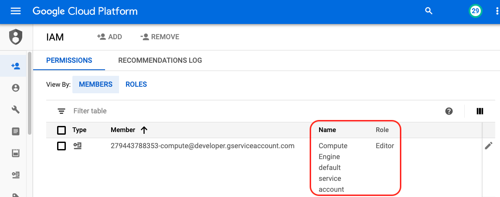
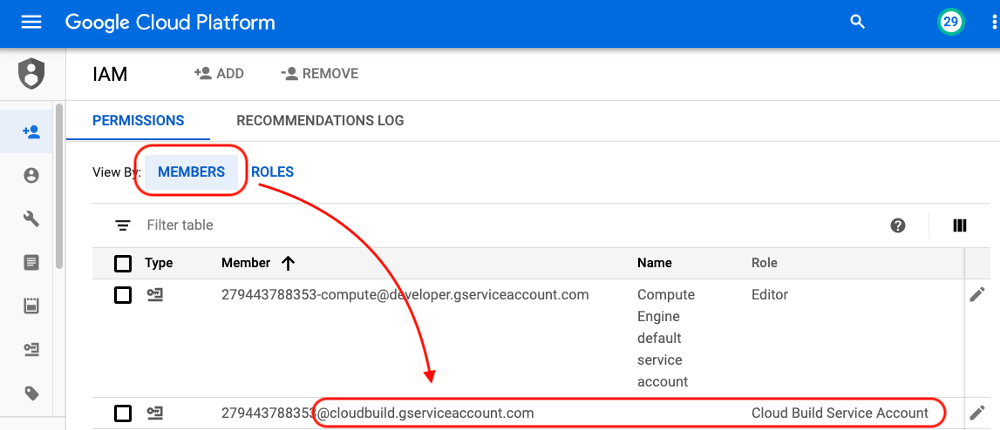

# Start VMs

Start user VMs from a ***Stage 3 VM*** image or instance template.

```diff
! IMPORTANT
```
If you don't have access to ***redislabs-university***, ask someone to export an image to GCS and use that (see below).

If starting in ***redislabs-university***, specify:
- Zone: ***us-west1-b***
- Machine Type: ***n1-standard-4***
- Network: ***training***

The latest version is ***2004*** with:
```diff
+ Ubuntu 18.04
+ RedisLabs 5.4
```


## To Start VMs

Use one for the following methods.

1. For a few VMs:

```bash
gcloud compute instances create user1 user2 --source-instance-template admin-training-3 --zone=us-west1-b --labels=version=2004,redis=5-4
 
```

2. For many VMs:

```bash
for i in {1..10} gcloud compute instances create user$i --source-instance-template admin-training-3 --zone=us-west1-b
 
```

3. For manual steps, go to ***Compute Engine > VM instances***. Click ***Create Instance*** and select ***from image*** or ***from template***.

## To export an image to GCS

See [Exporting a custom image to Cloud Storage](https://cloud.google.com/compute/docs/images/export-image).

To check if the CloudBuild API and account roles are set:

1. In the ***API & Service > Library*** page, search for ***cloudbuild*** and make sure its icon is blue.

 

2. In the ***IAM*** page, make sure the following are set.

***GCE service account*** has ***editor*** role



***CloudBuild API service account*** has roles:
- ***compute.Administrator***
- ***iam.ServiceAccountUser***
- ***iam.ServiceAccountTokenCreator***




