# Using the Lab

## Use the Desktop

1. You start with a blank desktop, 3 workspaces, and 5 launchers.

2. On ***workspace 1***, launch Chrome to work with admin consoles for DNS, Redis Insight, and the Redis Enterprise nodes. Because nodes aren't running yet, icons in node tabs do not display and admin pages on port ***8443*** return errors. When running, you can sign in to admin consoles and configure cluster, nodes, and databases.

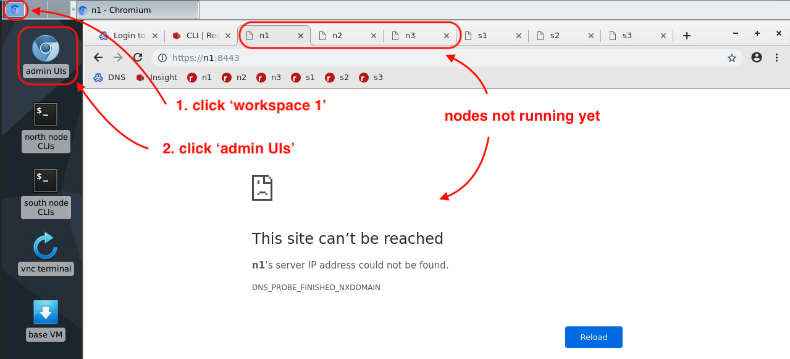

3. On ***workspace 2***, you SSH to node VMs and run commands like ***redis-cli***, ***rladmin***, and ***rlcheck***. Because nodes aren't running yet, shell tabs and SSH connections won't open.

4. When a node goes down, intentional or otherwise, you lose its SSH terminal. After a node restarts, you close and re-open the terminal window containing the shell to see it again.

4. On ***workspace 3***, you:
- Use ***vnc terminal*** to start and stop nodes, create clusters, and run DNS Utils
- Use ***base vm*** to install RE software in one of the labs.

## Create a Cluster

1. Go to ***workspace 3*** and launch the VNC terminal to start running nodes.

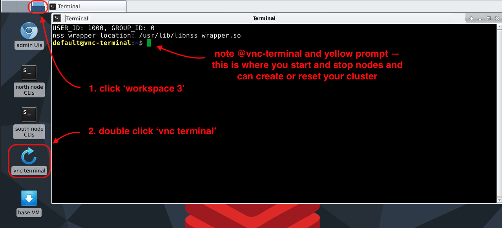

2. Run the following command to start nodes ***n1***, ***n2***, and ***n3*** (the cluster isn't created yet, only the nodes are started running).

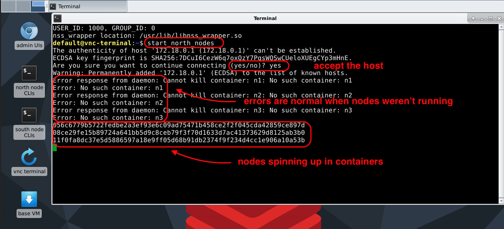

3. Return to ***workspace 1*** to start connecting nodes in a cluster. Refresh tabs for nodes ***n1***, ***n2***, and ***n3*** (tabs 3, 4, and 5 respectively). 

As nodes start running, tab icons display and pages return ***502 Bad Gateway*** messages.

4. Keep refreshing pages. Once running, the node redirects you to its ***Setup*** page where you can add that node to a cluster.

When available, click ***Setup*** in node ***n1***'s tag (tab 3) to create the ***north*** cluster and put node ***n1*** in it.

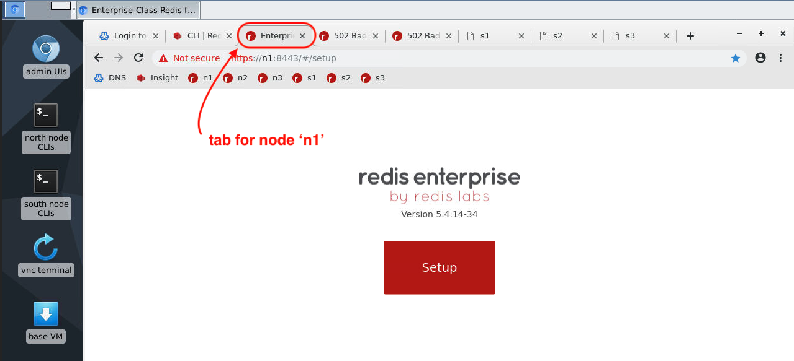

5. Node ***n1***'s IP address displays. Make sure ***Create Cluster*** is selected. Enter the cluster's Fully Qualified Domain Name as specified in DNS, which in this case is ***north.rlabs.org***. And click ***Next***.

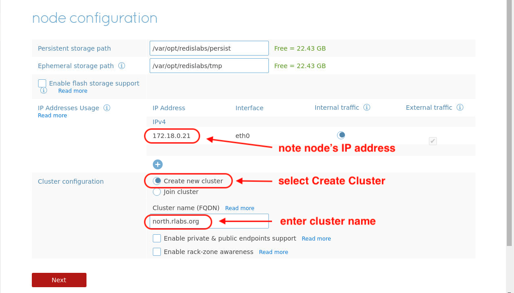

7. You don't have a license so just click ***Next*** to continue. If you had a license, you'd enter its key here.

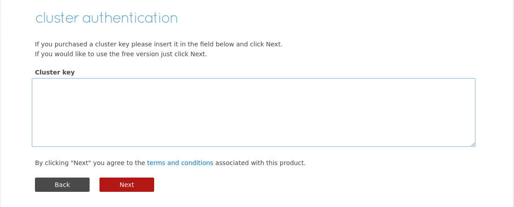

8. Enter admin credentials for the cluster. In this case, enter ***admin@rlabs.org*** and password ***admin***. And click ***Next***.

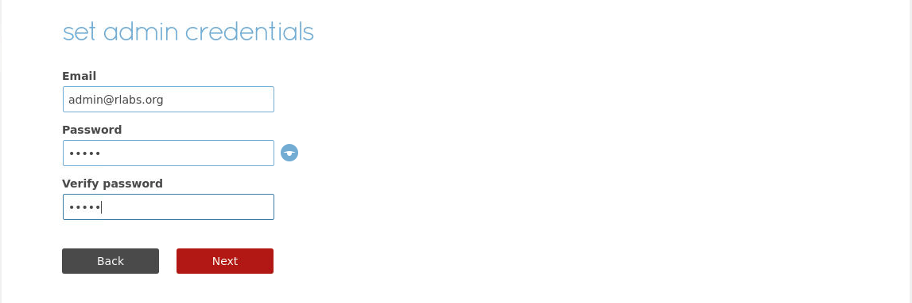

9. You'll be redirected back to the ***Login*** page. Sign in with cluster credentials you just created.

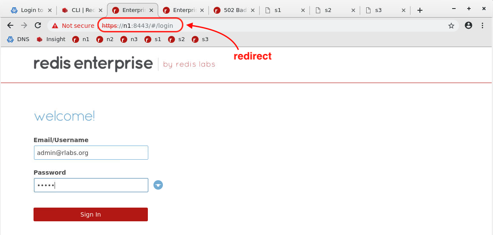

10. Now your node is part of a cluster. From here, you can act on the cluster, nodes, or databases.

11. Click ***nodes*** to view nodes in the cluster. There is only one so far.

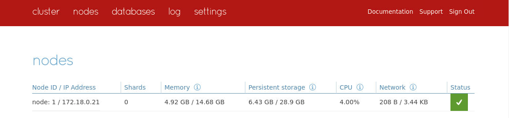

12. Add node ***n2*** to the cluster by clicking the second node tab and clicking ***Setup***.

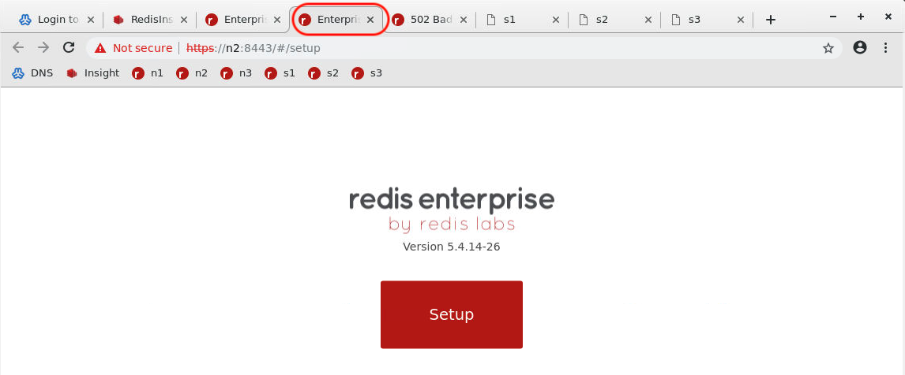

13. Its IP address displays. Click ***Join Cluster*** and enter the IP address of node ***n1*** along with the cluster admin credentials you just created. And click ***Next***.

14. Now two nodes are in the cluster.

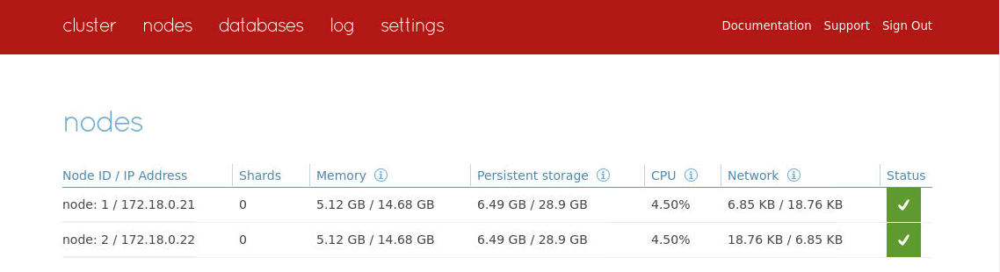

15. Add node ***n3*** to the cluster by clicking the third node tab and repeat steps for node ***n2***.

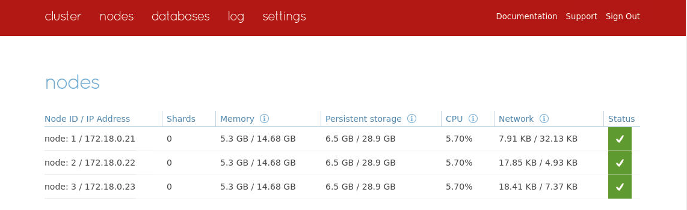

## Possible Issues:

1. Entering the wrong IP (an unreachable one).

2. Entering the cluster name, or your own IP, or the wrong credentials.

## Check Cluster Status

1. Go to ***workspace 2*** to view more cluster information. Double click the launcher for ***north node CLIs***. The window opens with 3 tabs SSH'd in to the nodes. On node ***n2*** or ***n3***, run ***rladmin status*** to get info on nodes, databases, endpoints, and shards. Right now you don't have any databases, so nothing shows up for databases, endpoints, or shards.

2. To run DNS tests, go to ***workspace 3***. Return to the ***vnc terminal*** window and enter ***run_dnsutils*** and ***nslookup n1.rlabs.org***. The DNS server is running on ***172.18.0.20***.

3. Run ***nslookup north.rlabs.org***. You get an authoritative answer from one of the nodes in the ***north*** cluster. In this case, ***n1.rlabs.org***. Run ***nslookup south.rlabs.org***. You get SERVFAIL because the ***south*** cluster isn't running yet and there are no nodes in it to respond.

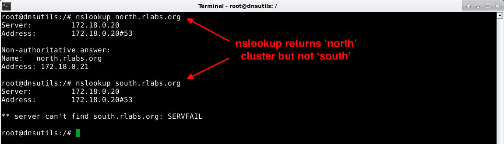

## Add a Database

1. Return to node ***n1***'s admin console and click ***databases*** to add a database to the cluster. 

2. Give it a name and 1 GB of RAM. Enter a password for the database admin (it could be different than the cluster admin). Leave Replication and Persistence disabled for now. Click ***Show advanced options***. 

21. Enter an endpoint port number between 10000-19999. In this case, enter 12000. Proxies in the cluster will listen for connections on port 12000 for this database. By default, only one proxy starts listening and it's on the node from which you create the database (in this case node ***n1***). Click ***Create*** to create the database (not shown).

22. Click the ***configuration*** tab to see database information including its endpoint location and connection URL.

23. Return to node ***n2*** or ***n3***'s SSH terminal to view updated details of your cluster. Note that you have a database running. It has a single proxy listening on node ***n1***. And it has one shard running on the node where you created the database.

24. Connect to your database using the ***redis-cli*** command line client from any node in your VM (in this case node ***n3***). It's good to test this from a host other than the one the endpoint is listening on to make sure DNS is resolving database and cluster lookups.

NOTE: This example uses simply the cluster name which is not entirely correct. You'll see why shortly.

25. Return to the vnc terminal and run ***dig @ns.rlabs.org north.rlabs.org*** to get more DNS information. Notice that all nodes in the cluster can provide an answers to where the proxy is listening and node ***n1*** provided the answer. It's tempting to think that dig is telling you where the proxy is listening, but it's not. It's telling which node is responding to queries about the cluster ***north.rlabs.org***. In a moment, you'll see how this distincation becomes clearer.

26.

27.

28.

29.

30.

31.

32.

33.

34.

35.

36.

37.

38.

39.

40.

41.

42.

43.

44.

45.

46.

47.

48.

49.

50.

51.

52.

53.

54.

55.

56.

57.

58.

59.

60.

61.

