# Using the Lab

## Use the Desktop

1. You start with a blank desktop, 3 workspaces, and 5 launchers.


2. On ***workspace 1***, launch Chrome to work with admin consoles for DNS, Redis Insight, and the Redis Enterprise nodes. Because nodes aren't running yet, icons in node tabs do not display and admin pages on port ***8443*** return errors. When running, you can sign in to admin consoles and configure cluster, nodes, and databases.


3. On ***workspace 2***, you SSH to node VMs and run commands like ***redis-cli***, ***rladmin***, and ***rlcheck***. Because nodes aren't running yet, shell tabs and SSH connections won't open.


4. When a node goes down, intentional or otherwise, you lose its SSH terminal. After a node restarts, you close and re-open the terminal window containing the shell to see it again.


4. On ***workspace 3***, you:
- Use ***vnc terminal*** to start and stop nodes, create clusters, and run DNS Utils
- Use ***base vm*** to install RE software in one of the labs.


## Create a Cluster

1. Go to ***workspace 3*** and launch the VNC terminal to start running nodes.


2. Run the following command to start nodes ***n1***, ***n2***, and ***n3*** (the cluster isn't created yet, only the nodes are started).


3. Return to ***workspace 1*** to start connecting nodes in a cluster. Refresh tabs for nodes ***n1***, ***n2***, and ***n3*** (tabs 3, 4, and 5). 

As nodes start, icons display in tabs and pages return ***502 Bad Gateway*** errors.


4. Keep refreshing pages. Once running, the node redirects you to its ***Setup*** page where you can add that node to a cluster.

5. When available, click ***Setup*** in the node ***n1*** tab (tab 3). 

Here, you create the ***north.rlabs.org*** cluster and add node ***n1*** to it.


IP address for node ***n1*** displays.

Make sure ***Create Cluster*** is checked.

6. Enter the cluster's Fully Qualified Domain Name ***north.rlabs.org.*** and click ***Next***.

This matches what is set in DNS which you'll see in a minute.


7. You don't have a cluster key so just click ***Next***.

If you had a license, you'd enter its key here.


8. Enter cluster admin credentials, ***admin@rlabs.org*** and password ***admin***, and click ***Next***.


You'll be redirected back to the ***Login*** page.

9. Sign in with cluster credentials you just created.


10. Now your node is part of a cluster. From here, you can act on the cluster, nodes, or databases.


11. Click ***nodes*** to view nodes in the cluster. There is only one so far.


12. Add node ***n2*** to the cluster by clicking its tab and clicking ***Setup***.


Its IP address displays.

13. Click ***Join Cluster***. Enter the node ***n1*** IP address, cluster admin credentials you just created, and click ***Next***.


14. Now two nodes are in the cluster.


15. Add node ***n3*** to the cluster by clicking the third node tab and repeat steps for node ***n2***.


### Possible Issues to this Point

1. Entering the wrong IP (an unreachable one).

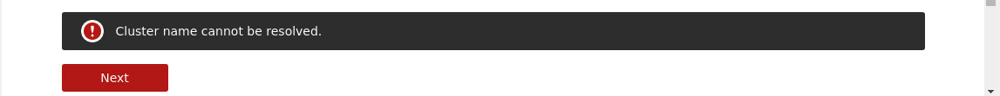

2. Entering a cluster name, a reachable, but incorrect IP, or wrong credentials.

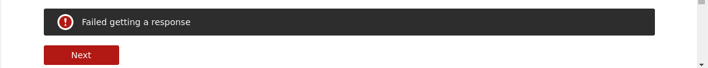

3. Spinner keeps spinning in the web page. Admin console session timed-out. Remove ***/#/loading*** from the URL and hit return to get a new sign-in page.


### Status Check to this Point

1. Go to ***workspace 2*** and launch ***north node CLIs***.

The window opens with 3 tabs SSH'd in to the nodes.

In node ***n3***, get status on nodes and databases by running:

```bash
rladmin status
 
```

Right now you don't have any databases, so nothing shows up for databases, endpoints, or shards.


Explore DNS.

2. Go to ***workspace 3*** and run the following in ***vnc terminal***.

```bash
run_dnsutils
nslookup n1.rlabs.org
 
```

The DNS server is running on ***172.18.0.20***.


3. Run

```bash
nslookup north.rlabs.org
nslookup south.rlabs.org
 
```

nslookup returns an authoritative answer from ***n1*** in the ***north*** cluster.
nslookup returns SERVFAIL for the ***south*** cluster because there aren't any nodes in it to respond yet.


Now you're ready to add a database to your cluster.

## Add a Database

1. Return to node ***n1***'s admin console and click ***databases***. 


2. Give it a name and 1 GB of RAM. Enter a password for the database admin (it could be different than the cluster admin). 

Leave ***Replication*** and ***Persistence*** disabled for now. 

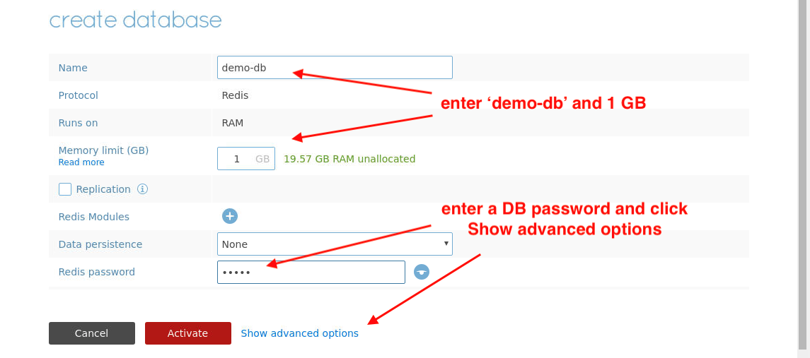

3. Click ***Show advanced options*** and enter 12000 for the port number.

Proxies listen for connections on this port for this database. By default, only one proxy starts listening and it's on the node where you created the database (in this case node ***n1***). Click ***Activate*** to create the database.


4. Click the ***configuration*** tab to see database information including its endpoint location and connection URL.


5. Return to the node ***n3*** SSH terminal to view updates.

You have a database running. It has a single proxy listening on node ***n1***. And it has one shard running on the node where you created the database.


Connect to your database using ***redis-cli***.

You can run this from anywhere that has DNS resolution to your cluster ***north.rlabs.org***. It's good to test from a host other than the one the endpoint is listening on to make sure DNS is resolving.

6. Run ***redis-cli*** on node ***n3***. 

```bash
redis-cli -p 12000 -h redis-12000.north.rlabs.org
 
```

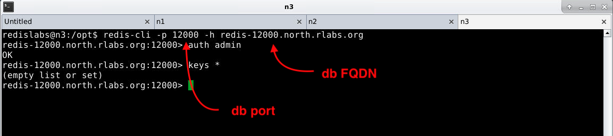

7. Authenticate with the DB password you provided when you created the database.

```bash
auth admin
```

8. Check to see that you're really connected and authenticated

```bash
keys *
```

9. Set a key and value in the database.

```bash
set hello world
```

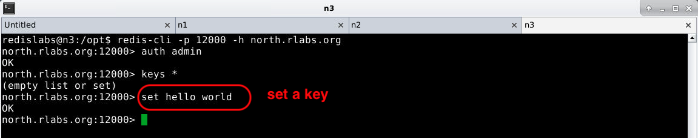

Return to ***vnc terminal*** and perform some more DNS checks.

11. Get some information on how DNS resolves the IP to your database proxy.

```bash
dig @ns.rlabs.org redis-12000.north.rlabs.org
 
```

Nodes run DNS name servers that resolve queries to DB proxies. DNS does not know where proxies are listening, it only knows the nodes.

In this case, node ***n1*** provides the answer. It's tempting to think that dig is telling you where the proxy is listening, but it's not. It's only telling which node is responding to database queries for ***redis-12000.north.rlabs.org***.

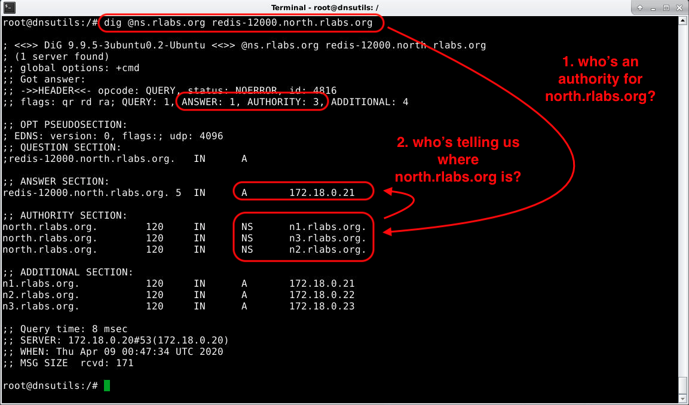

Check the DNS server to see how records are configured for this cluster. 

12. Go to ***workspace 1*** and open the ***BIND*** tab in Chrome (tab 1) and sign in with credentials: ***root*** and ***password***.

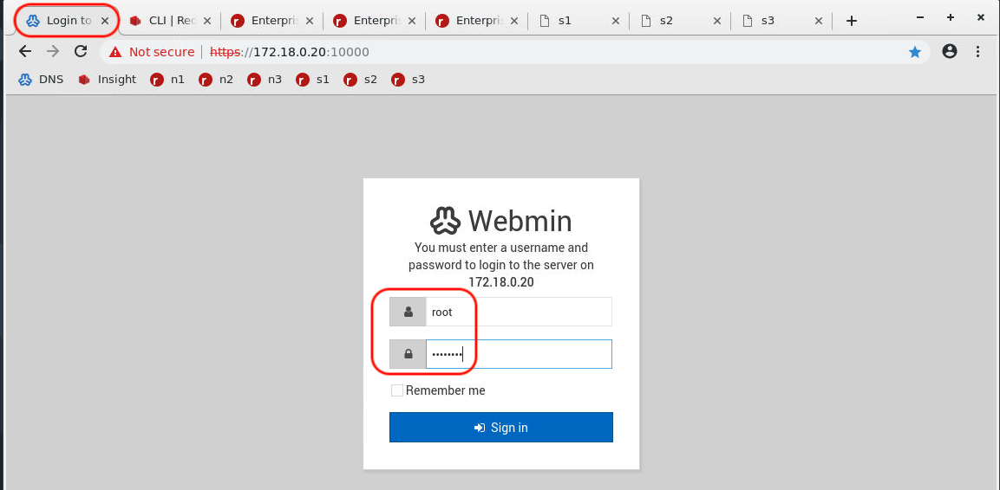

13. Navigate to ***Servers > BIND DNS Server***. click the ***rlabs.org*** zone icon at the bottom.


14. Click ***Edit zone records file*** to view the DNS records.


These zone records say, "For URL requests to the domain ***north.rlabs.org*** (your cluster), there are 3 name servers (***n1***, ***n2***, ***n3***) that can provide IPs of proxies listening for databases in that cluster. 

This allows proxies to listen on various nodes and move about as nodes go up or down, databases start or stop, or proxy policies change.

You don't have to change DNS every time that happens. All you supply is the name of your cluster and NS and A records for your nodes.

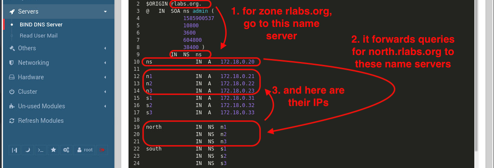

### Status Check to this Point

1. Double check you can connecct from anywhere.

Go to ***workspace 1*** and open ***Redis Insight*** in Chrome (tab 2), and click ***Add Redis Database > Add Database***.

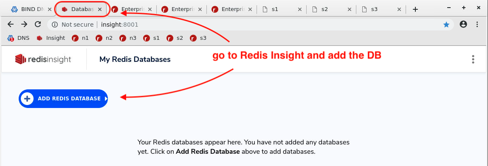

2. Enter a database name (can be anything), host and port, DB password (if given), and click ***Add Redis Database***.

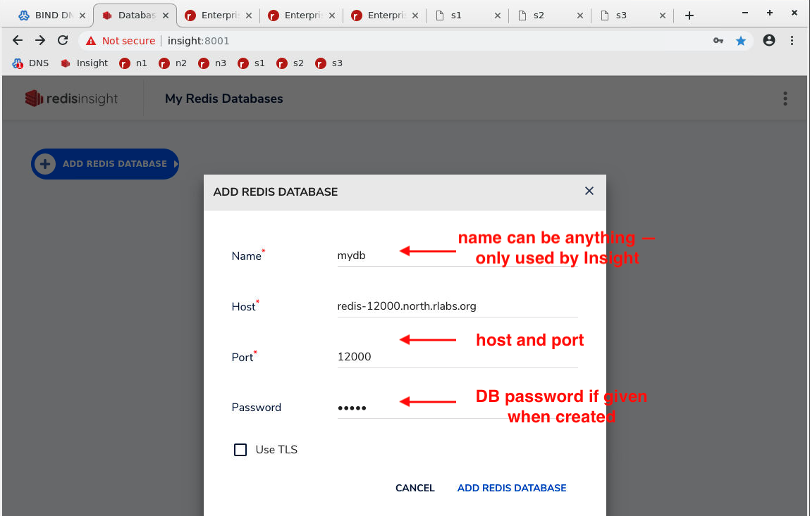

3. If connection is successful, the DB icon appears. Click it to connect.

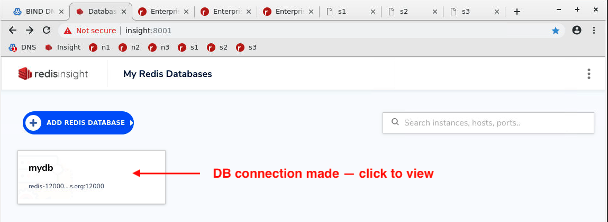

4. Click ***Browser*** to view and work with DB keys and data.

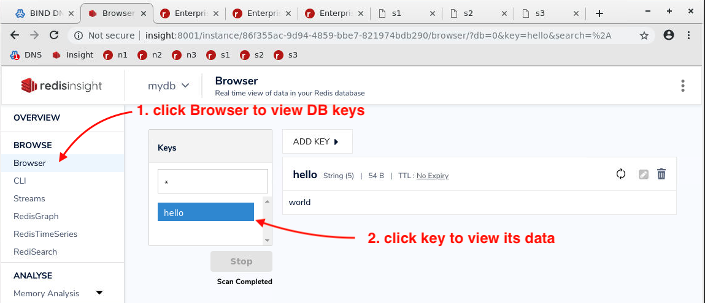

5. Click ***CLI*** to execute Redis commands on the database.

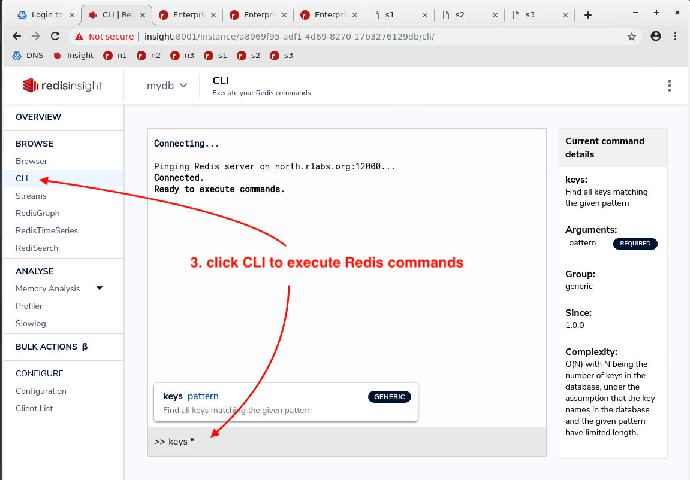

You've connected to a DNS-resolvable database by command-line and Insight UI.

Now you're ready to stop nodes and see what happens during failover.

## Stop Nodes and Explore Failover

Return to ***vnc terminal*** to stop and restart nodes and see how failover works.

1. In ***vnc terminal***, exit from ***dns_utils***

```bash
exit
 
```
2. Stop node ***n1***.

```bash
stop_n1
 
```

You'll see the node that stopped (***n1***) and the connection closed from the base VM where the command was run ***172.18.0.1***.

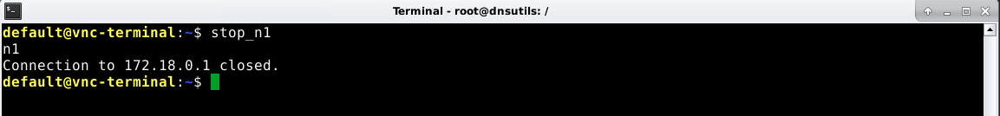

3. Return to ***n3*** SSH terminal on ***workspace 2***. Exit ***redis-cli*** if still connected.

```bash
exit
 
```

4. Get latest cluster status.

```bash
rladmin status
 
```

SSH tab to node ***n1*** closes, node ***n1*** is down, proxy on another node (***n2***) starts listening, and the database is down because the only master shard is down with no replica.

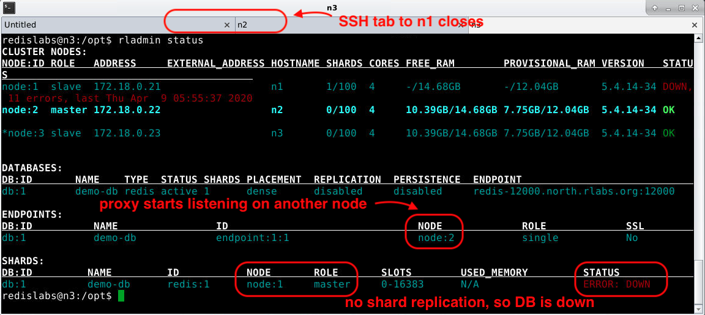

5. Reconnect to the database with ***redis-cli***

Connection to proxy on node ***n2*** works. But the only master shard that was running is down, without a replica, so no Redis instance replies to requests for data.

```bash
redis-cli -p 12000 -h redis-12000.north.rlabs.org
 
```
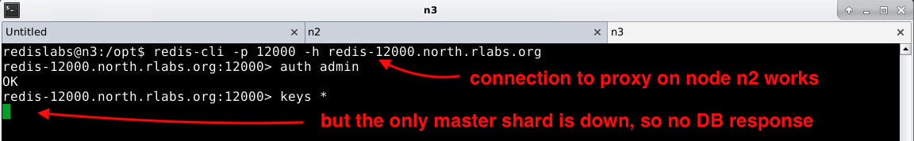

5. Return to ***vnc terminal*** and restart node ***n1***.

```bash
start_n1
 
```

Again, you see the node that's started (***n1***) and connection closed to the base VM where this command was run.


6.


35.


36.


37.


38.


39.


40.


41.


42.


43.


44.


45.


46.


47.


48.


49.


50.


51.


52.


53.


54.


55.


56.


57.


58.


59.


60.


61.


