# Lab/Product Demo

Here you'll do the following in 85 easy steps:
1. Use the lab environment
2. Create a cluster
3. Add a database
4. Explore DNS
5. Use Redis Insight
6. Fail nodes
7. Enable replication and clustering
8. Lose quorum and restore the cluster.

## Use the Lab Environment

1. You start with a blank desktop, 3 workspaces, and 5 launchers.


2. On ***workspace 1***, launch Chrome to work with admin consoles for DNS, Redis Insight, and the Redis Enterprise nodes.


3. On ***workspace 2***, you SSH to node VMs and run commands like ***rladmin*** and ***redis-cli***. 

When a node goes down, intentional or otherwise, you lose its SSH terminal. Just re-open the window when the node's back.

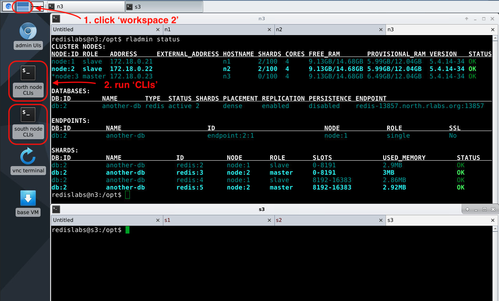

4. On ***workspace 3***, you:
- Use ***vnc terminal*** to start and stop nodes, create clusters, and check DNS
- Use ***base vm*** to install RE software in a lab.

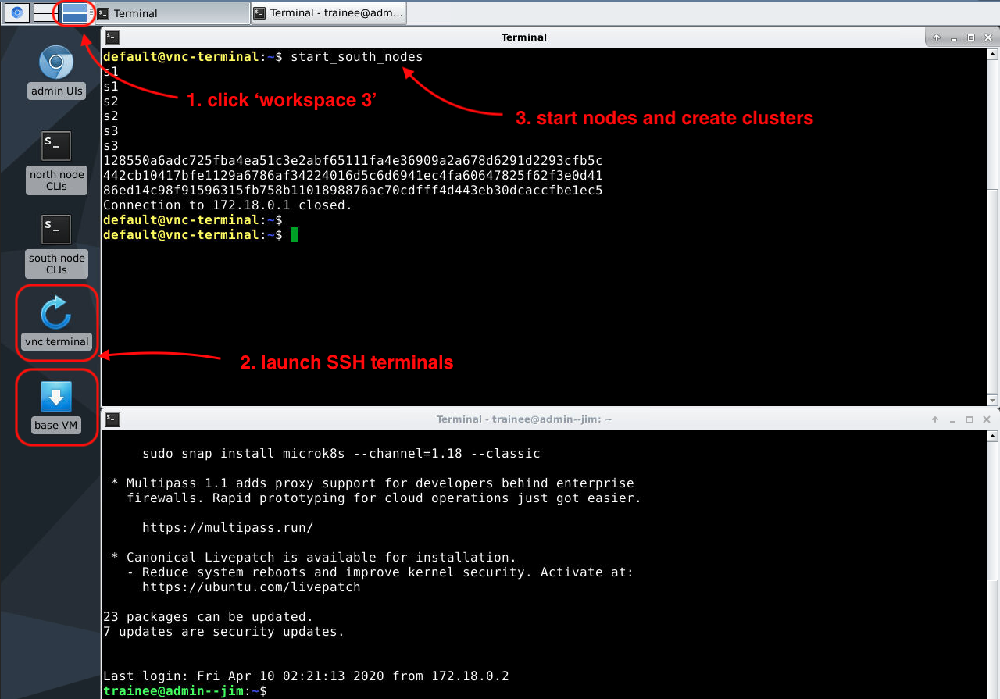

## Create a Cluster

1. Go to ***workspace 3*** and launch the VNC terminal to start running nodes.


2. Run the following command to start nodes ***n1***, ***n2***, and ***n3*** (the cluster isn't created yet, only the nodes are started).


3. Return to ***workspace 1*** to start connecting nodes in a cluster. Refresh tabs for nodes ***n1***, ***n2***, and ***n3*** (tabs 3, 4, and 5). 

As nodes start, icons display in tabs and pages return ***502 Bad Gateway*** errors.

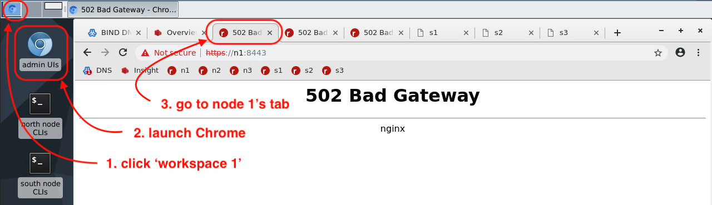

4. Refresh pages.

Once running, nodes redirect to the ***Setup*** page where you add nodes to clusters.


5. When available, click ***Setup*** in node 1's tab (tab 3).

Here you create the cluster ***north.rlabs.org*** and add node ***n1*** to it:
- IP address for node ***n1*** displays
- Make sure ***Create Cluster*** is checked
- Enter the cluster's FQDN ***north.rlabs.org*** (you'll see matching DNS settings in a minute)
- Click ***Next***.


6. You don't have a cluster key so just click ***Next***.

If you had a license, you'd enter its key here.


7. Enter cluster admin credentials, ***admin@rlabs.org*** and password ***admin***, and click ***Next***.


8. You're redirected to the ***Login*** page.

Sign in with cluster credentials you just created.


9. Now your node is part of a cluster. From here, you can act on the cluster, nodes, or databases.


10. Click ***nodes*** to view nodes in the cluster. There is only one so far.


11. Add node ***n2*** to the cluster by clicking its tab and clicking ***Setup***.


12. Node 2's IP address displays
- Click ***Join Cluster***
- Enter node 1's IP address (it's part of the cluster)
- Re-enter cluster admin credentials you just created
- Click ***Next***.


13. Now two nodes are in the cluster.


14. Add node ***n3*** to the cluster by clicking the third node tab and repeat steps for node ***n2***.


### Possible Issues to this Point

1. Entering the wrong IP (an unreachable one).


2. Entering a cluster name, a reachable, but incorrect IP, or wrong credentials.


3. Spinner keeps spinning in the web page. Admin console session timed-out. Remove ***/#/loading*** from the URL and hit return to get a new sign-in page.


### Status Check to this Point

1. Go to ***workspace 2*** and launch ***north node CLIs***.

The window opens with 3 tabs SSH'd in to the nodes.

In node ***n3***, get status on nodes and databases by running:

```bash
rladmin status
```

Right now you don't have any databases, so nothing shows up for databases, endpoints, or shards.


Explore DNS.

2. Go to ***workspace 3*** and run the following in ***vnc terminal***.

```bash
run_dnsutils
nslookup n1.rlabs.org
```

The DNS server is running on ***172.18.0.20***.


3. Run

```bash
nslookup north.rlabs.org
nslookup south.rlabs.org
```

nslookup returns an authoritative answer from ***n1*** in the ***north*** cluster.
nslookup returns SERVFAIL for the ***south*** cluster because there aren't any nodes in it to respond yet.


Now you're ready to add a database to your cluster.

## Add a Database

1. Return to node ***n1***'s admin console and click ***databases***. 


2. Give it a name and 1 GB of RAM. Enter a password for the database admin (it could be different than the cluster admin). 

Leave ***Replication*** and ***Persistence*** disabled for now. 


3. Click ***Show advanced options*** and enter 12000 for the port number.

Proxies listen for connections on this port for this database. By default, only one proxy starts listening and it's on the node where you created the database (in this case node ***n1***). Click ***Activate*** to create the database.


4. Click the ***configuration*** tab to see database information including its endpoint location and connection URL.


5. Return to the node ***n3*** SSH terminal to view updates.

You have a database running. It has a single proxy listening and one shard running on the node where you created the database (in this case ***n1***).


6. Connect to your database using ***redis-cli*** on node ***n3***. 

You can run this from anywhere that has DNS resolution to ***north.rlabs.org***.

But it's useful to test from a host other than the one the endpoint is listening on to make sure DNS resolves.

```bash
redis-cli -p 12000 -h redis-12000.north.rlabs.org
```


7. Authenticate with the DB password you provided when you created the database.

```bash
auth admin
```

8. Check to see that you're really connected and authenticated

```bash
keys *
```

9. Set a key and value in the database.

```bash
set hello world
```


10. Return to ***vnc terminal*** and get more information on how DNS resolves DB queries.
- Nodes run DNS name servers that resolve DB queries to proxy IPs
- DNS does not know where proxies listen, it only knows nodes.

In this case, ***n1*** provides the answer. It's tempting to think that dig is telling you where the proxy is listening, but it's not. It's only telling which node is responding to DB queries.

```bash
dig @ns.rlabs.org redis-12000.north.rlabs.org
```


11. Check your corporate DNS server to see how records are configured for your cluster. 
- Go to ***workspace 1*** 
- Open the ***BIND*** tab (tab 1)
- Sign in with ***root*** and ***password***.


12. Navigate to ***Servers > BIND DNS Server*** and click the ***rlabs.org*** zone icon at the bottom.

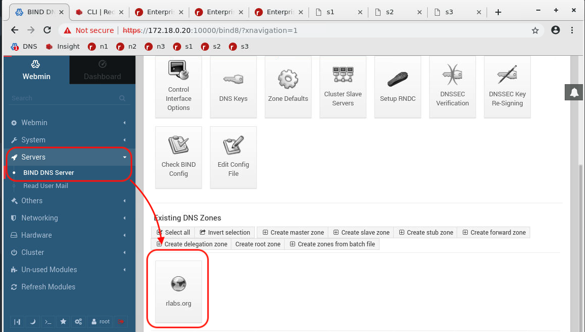

13. Click ***Edit zone records file*** to view the DNS records.


14. These zone records say:
- For DB requests to cluster ***north.rlabs.org***
- There are 3 name servers (***n1***, ***n2***, ***n3***) who provide proxy IPs.

This allows proxies to listen on various nodes and move about as nodes or databases start or stop or configuration changes, without affecting DNS.

All you supply is your cluster name and NS and A records for nodes.


### Status Check to this Point

1. Double check you can connecct from anywhere.

Go to ***workspace 1*** and open ***Redis Insight*** in Chrome (tab 2), and click ***Add Redis Database > Add Database***.


2. Enter a database name (can be anything), host and port, DB password (if given), and click ***Add Redis Database***.


3. If connection is successful, the DB icon appears. Click it to connect.


4. Click ***Browser*** to view and work with DB keys and data.


5. Click ***CLI*** to execute Redis commands on the database.


You've connected to a DNS-resolvable database by command-line and Insight UI.

Now you're ready to stop nodes and see what happens during failover.

## Stop a Node and Explore Failover

Return to ***vnc terminal*** to stop and restart nodes and see how failover works.

1. In ***vnc terminal***, exit from ***dns_utils***

```bash
exit
```
2. Stop node ***n1***.

```bash
stop_n1
```

You'll see the node that stopped (***n1***) and the connection closed from the base VM where the command was run ***172.18.0.1***.


3. Return to ***n3*** SSH terminal on ***workspace 2***. Exit ***redis-cli*** if still connected.

```bash
exit
```

4. Get latest cluster status.

```bash
rladmin status
```

SSH tab to node ***n1*** closes, node ***n1*** is down, proxy on another node (***n2***) starts listening, and the database is down because the only primary shard is down with no replica.


5. Reconnect to the database with ***redis-cli***

Connection to proxy on node ***n2*** works. But the only primary shard that was running is down, without a replica, so no Redis instance replies to requests for data.

```bash
redis-cli -p 12000 -h redis-12000.north.rlabs.org
auth admin
keys *
```


6. Return to ***vnc terminal*** and restart node ***n1***.

```bash
start_n1
```

Again, you see the node ***n1*** started and connection closed to the base VM where the command was run.

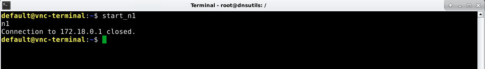

7. Return to node 3's SSH terminal. Close and re-open the window to regain node 1's tab.

```bash
rladmin status
```

Proxy still listens on node 2 (it did not return to node 1). DB is running, but is there any data?


8. Reconnect to ***redis-cli***, authenticate, and list keys. 

```bash
redis-cli -p 12000 -h redis-12000.north.rlabs.org
auth admin
keys *
exit
```

There's no data because there's no DB replication or persistence. When the shard restarts, it's empty.

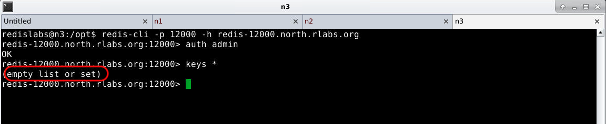


9. Return to ***vnc terminal*** and re-run dig on the database connection.

```bash
dig redis-12000.north.rlabs.org
```

Node 2 answers where proxy listens (which happens to be the same node).

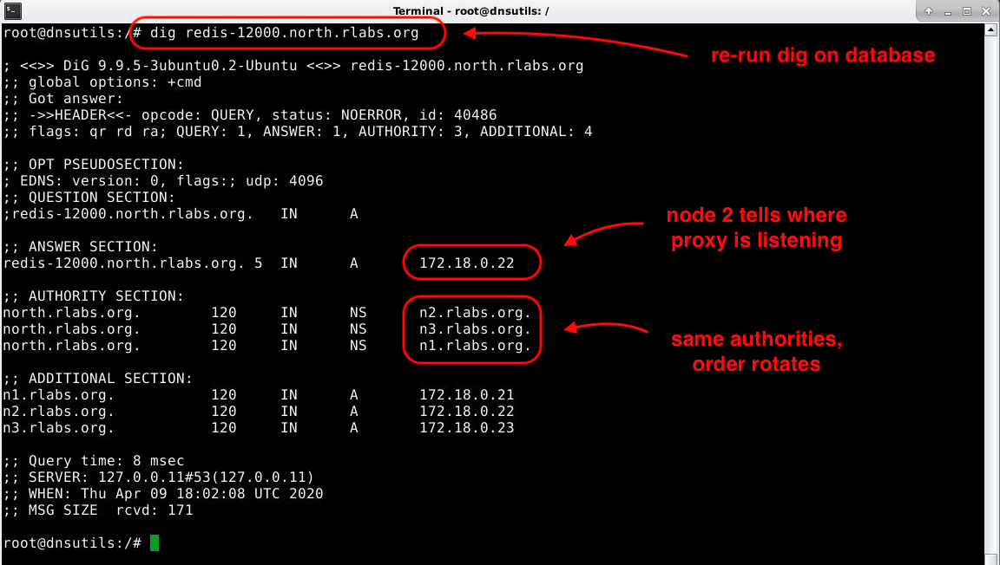

Now you're ready to explore a database with more options.

## Enable Database Replication and Clustering

It's called ***database clustering***, but it splits your data into ***shards***.

This allows databases to scale horizontally for:
- Larger datasets on cheap hardware
- Shorter latency with more instances responding.

Replication and clustering require 4 shards minimum: 2 primaries, 2 replicas.

Free license only provides 4, so you need to remove your old database. 

1. Return to admin console.

Run this from node 1.

It could be any node, but node 1 will highlight something in DNS later.

Click ***databases*** and the ***demo-db*** link to view, edit, or delete it.

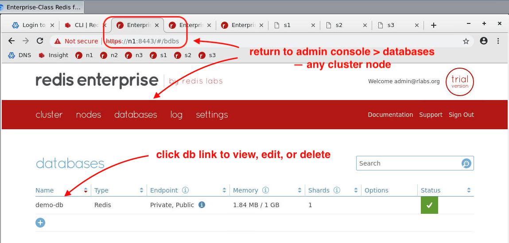

2. Click the ***configuration*** tab, scroll to the bottom, and click ***Delete***.

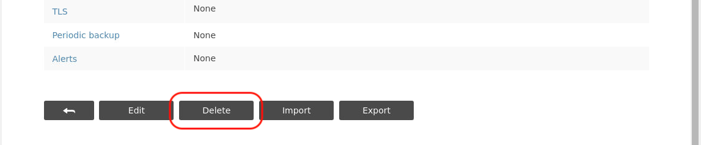

3. Go to ***Redis Insight***, click the ***Redis Insight*** logo (top-left), and click the old database link.

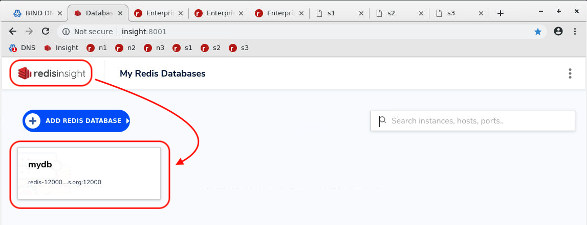

4. If the server is unreachable, it reports ***server offline***.

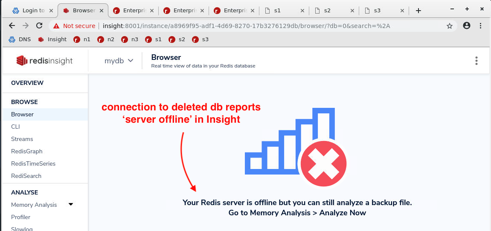

5. Return to node 1's admin console where you were before on the ***databases*** tab and click the ***+*** icon to add a new database.

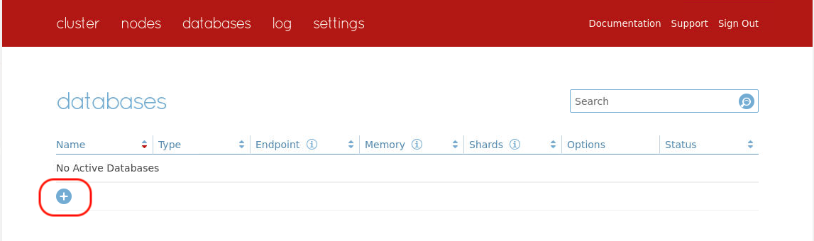

6. Click ***Show advanced options*** and enter the following information:

| Field | Value |
|---|---|
| Name | ***another-db*** |
| Memory limit | ***1 GB*** |
| Replication | ***enabled*** |
| Password | ***none - leave it blank*** |
| Database clustering | ***enabled*** |
| Endpoint port number | ***13000*** |

Note the number of shards that will be created (4 total).


7. Click ***Activate***.

8. Click the ***databases*** tab and note the status:
- Shards: 2 primary (4 total)
- Replication (R) and shard clustering (C) enabled


9. Return to ***workspace 2*** and enter the following in node 3's SSH shell

```bash
rladmin status
```

There are some subtle, but important things to note:
- Under ***Databases***: 2 primary shards, ***dense*** placement, replication
- Under ***Endpoints***: proxy listening on node 1 again
- Under ***Shards***: primaries on node 1, replicas on node 2 (***dense*** placement packs shards and proxy in as few of nodes as possible for shorter latency)


### Status Check to this Point

1. Return to ***vnc terminal*** on ***workspace 3*** and run the following to find out more about how DNS is behaving.

```bash
run_dnsutils
nslookup north.rlabs.org
nslookup redis-13000.north.rlabs.org
```

What you find is that node 2 is providing answers for proxy IPs.
But the proxy is listening for the database is on node 1.


2. Run the following in node 3's SSH terminal to set a database key.

```bash
redis-cli -p 13000 -h redis-13000.north.rlabs.org
set hello world
exit
```

Note, you didn't need to authenticate this time because you didn't set a database password during creation.

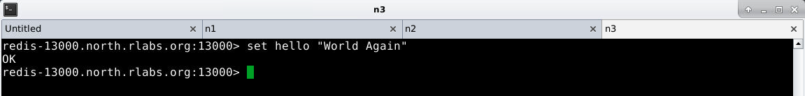

3. Return to ***Redis Insight*** and connect to the new database (no password). Then you can view the key and value.


### Possible Issues to this Point

1. If you receive either of the following from ***nslookup*** or ***dig***, you may have not set your port properly

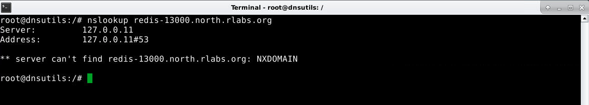

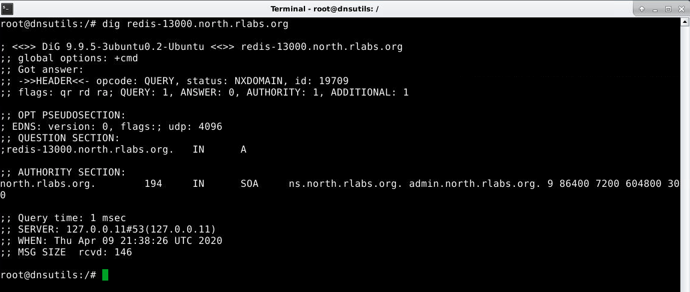

2. Check your port setting in ***rlamdin*** or admin console.

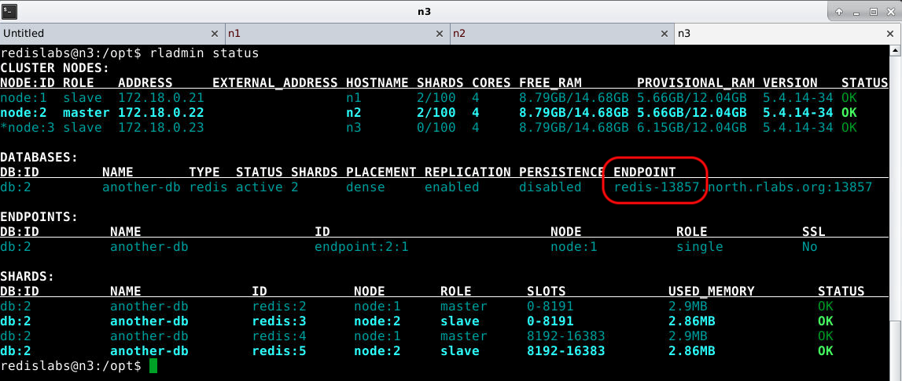

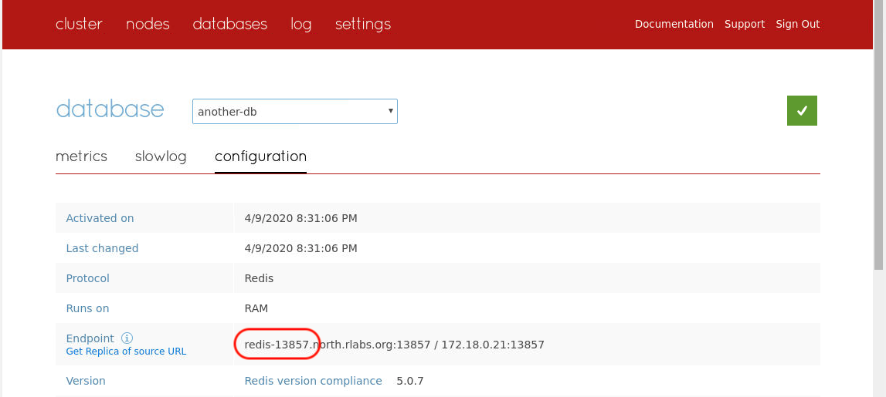


## Stop a Node and Explore Failover with Replication and Clustering

1. Return to ***vnc terminal*** and stop node 1.

```bash
stop_n1
```


2. Return to node 3's SSH shell and review node, proxy, and database status

```bash
rladmin status
```

Node goes down, proxy migrates, primary shards are demoted, and replica shards promote to primaries.

This happens almost instantly in production.

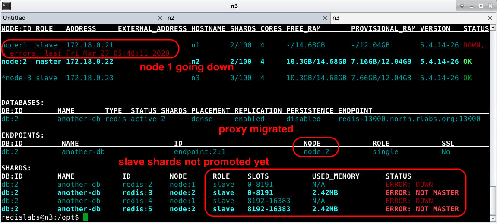


3. Node 1 is down. Replica shards are promoted to primaries on node 2. Replica shards on node 1 are down because the node is down.

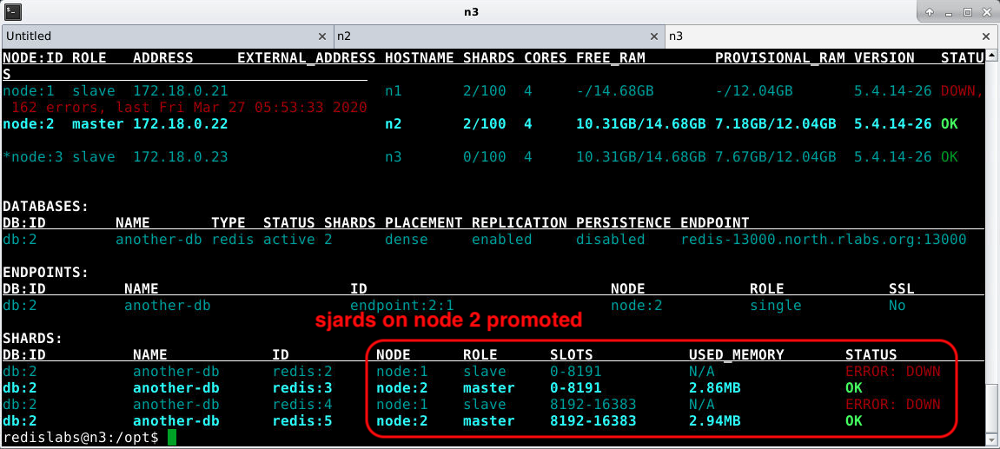

4. Connect to ***redis-cli*** on node 3 and notice that data is available because shards are replicated.


5. Restart node 1 in ***vnc terminal***.

```bash
start_n1
```


6. If a failed node with primary shards returns in a given time limit, shards restart as replicas to new primaries on other nodes.

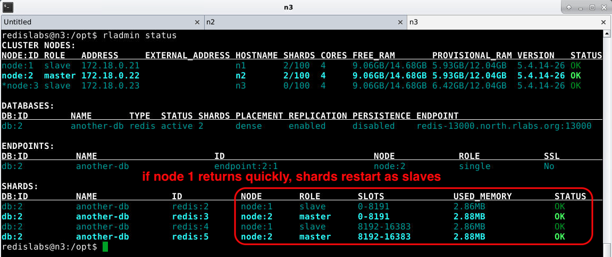

## Reverse the failover

1. Stop node 2 in ***vnc terminal*** and see what happens.

```bash
stop_n2
```


2. Return to node 3's SSH terminal and see what's happening.

You lose node 2's tab, the proxy and primary shards return to node 1.

You may wonder why your cluster isn't using node 3. Remember, you're using ***dense*** placement.

You could try the same steps with ***sparse*** placement and see what happens.


3. Instead, stop a second node and see what happens.

```bash
stop_n1
```

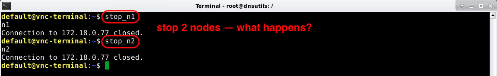

4. Return to node 3's SSH shell and recheck the status.

After about 30 seconds, the cluster reports an error.

Why is that? Remember, you lost 2 nodes. Your cluster lost quorum and stops responding to admin requests.


5. But what about the data? You should have that right because proxies keep listening and shards keep responding if quorum is lost.

Return to ***Redis Insight***, click ***Browser*** and what do you get?

Wait, proxy down! Why is that shouldn't it be listening on whatever node is up and running (like node 3).

Not in this case. Proxy policy is set to ***single*** by default. Only 1 proxy listens at a time. If you lose quorum, no admin updates can be made, so a new proxy can't start listening. If you set proxy policy to ***all nodes*** proxies would  be listening and DNS would re-route you automatically.

You can repeat these steps with ***all nodes*** proxy policy and see what happens.

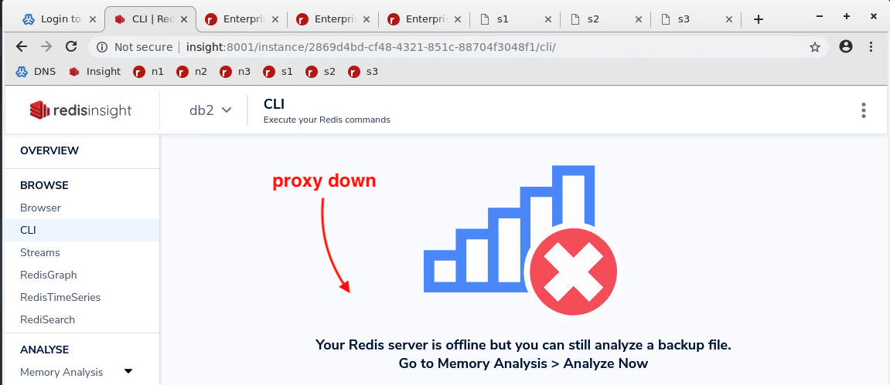

6. Restart nodes 1 and 2 in ***vnc terminal***.

```bash
start_n1
start_n2
```


7. Return to node 3's SSH terminal and see what happens.

```bash
rladmin status
```

It may take a try or two, but it should come back with your database intact.

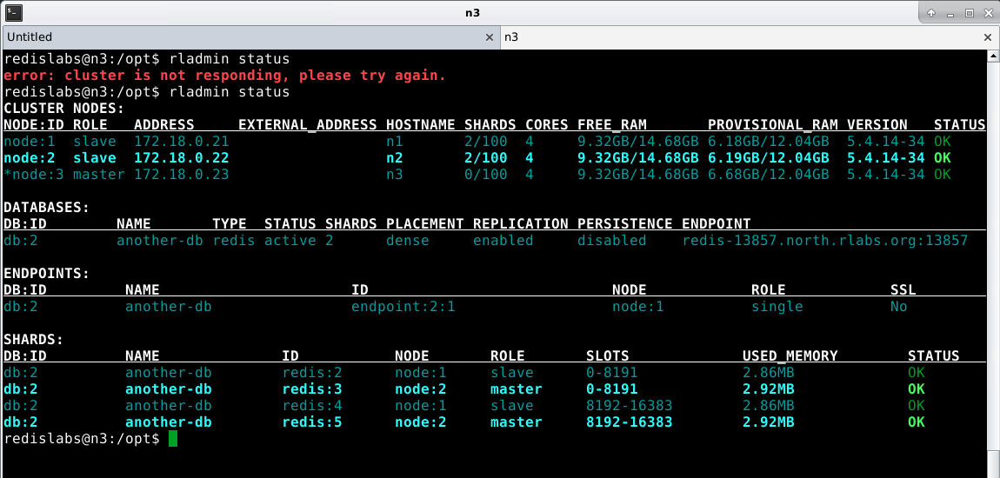

### Possible Issues to this Point

1. Restoring quorum can be hit or miss. If there's anything wrong, say with DNS, you might get an error like the following. If that happens, you can restore a cluster by resetting it or open a Support ticket for help recovering it.

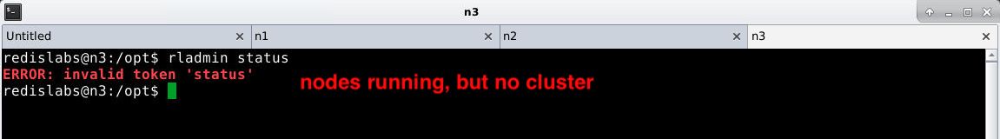


## Restoring the nodes and cluster - brute force

If you need to reset the lab cluster for any reason, here's how to do it by brute force.

1. Return to ***vnc terminal*** and run

```bash
start_north_nodes
```

There's a 60 second 'sleep' command at the end of the script that waits for nodes to fully start before letting your run the next command. 


2. Run the next command to recreate the nodes into a cluster.

Sometimes you need to wait an additional 20 seconds before you run this. If you get an error, try again.

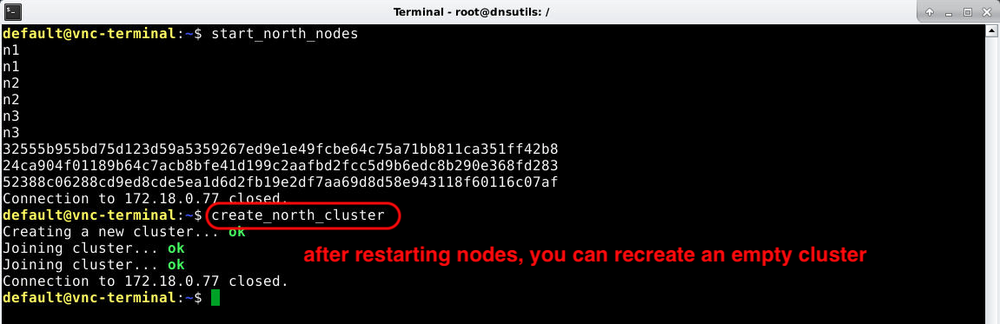

3. Re-launch ***north node CLIs*** on ***workspace 2*** to make sure tabs are open to all nodes and run the following in one of the nodes SSH terminals.

```bash
rladmin status
```

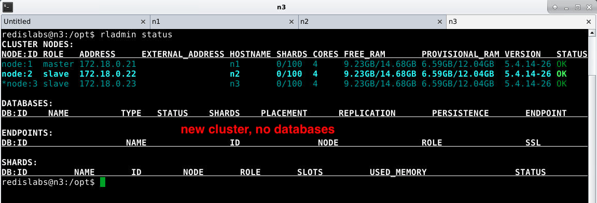

Congratulations! That's it. Now you know how to start and stop nodes, put them in clusters, add databases to clusters, investigate DNS, and watch nodes fail and come back.
