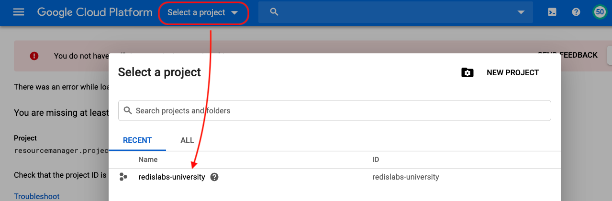
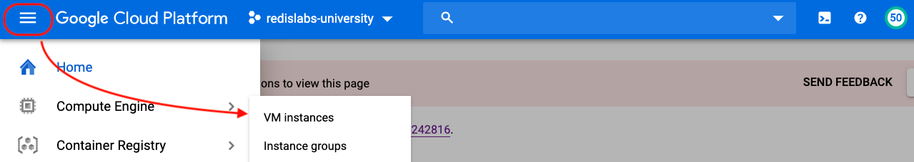
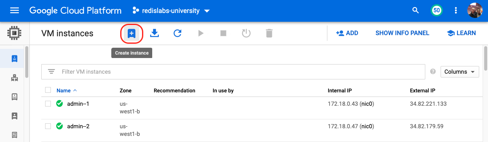
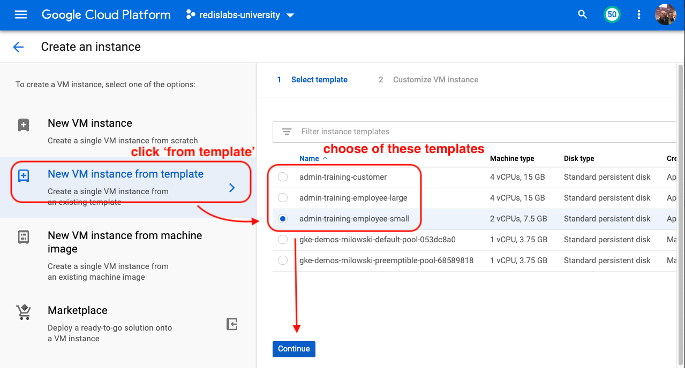
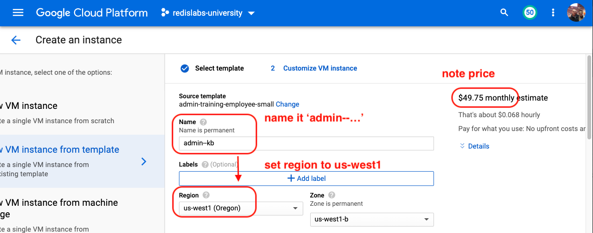
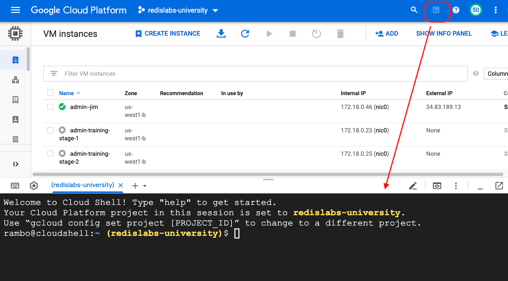
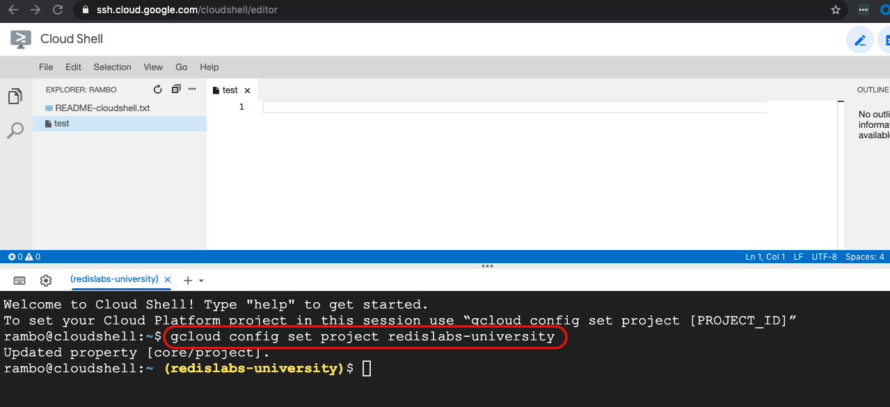

# Lab Overview

Running a cluster of RE instances can be done in one of several ways:
- in a group of containers (using Docker, Kubernetes, or a cloud service)
- in a group of VMs.

## Here's what you get

This lab simulates a group of VMs with:
- easy startup, shutdown, and reset
- control of DNS.

What you get is a single VM with:
- Desktop access on port 80
- An internal network
- DNS
- Redis Insight
- 6 RE nodes.


Nodes run in containers, but they look like VMs because they have hostnames, IPs, and DNS resolution.

All a user needs to access a VM is its public IP and VNC password.

Here's what the desktop looks like when you first sign in.


## How to get a VM

If you're a student, your instructor will provide with a public IP and VNC password.

If you can manage VMs in the ***redislabs-university*** GCP project, you can spin up your own.

There are 2 simple options for doing this with a VM template.

### Option 1 - Admin Console

1. Point your browser to:

```bash
https://console.cloud.google.com
```

2. Make sure your project is set to ***redislabs-university***.


  
3. Go to the Navication Menu and choose ***Compute Engine > VM instances***.



4. Click ***Create Instance***.



5. Click ***New VM instance from template***, choose one of the highlighted templates (***customer*** for students, ***small*** for yourself if possible), and click ***Continue***.



6. Name your instance starting with ***admin--***, set the region to ***us-west1*** and select a zone, note the price, and click ***Create***.



7. Wait about 2 minutes for the instance to fully start.

8. Point your browser to the VM's public IP.

9. Click in the login box and sign in with ***trainee!*** .

### Option 2 - Cloud Shell

1. Point your browser to:

```bash
https://console.cloud.google.com
```

2. Make sure your project is set to ***redislabs-university*** and click ***Activate Cloud Shell***



Alternatively, you can point your browser to:

```bash
https://ssh.shell.google.com/cloudshell
```

Make sure your project is set to ***redislabs-university*** by running:

```bash
gcloud config list
```

If it's not set, run:

```bash
gcloud config set project redislabs-university
```



3. Run the command shown below to create instances.

NOTE: This command creates two instances ***admin--1*** and ***admin--2*** using the ***admin-training-employee-small*** template. Remember to specify ***us-west1-b*** and the zone.

```bash
gcloud compute instances create admin--1 admin--2 --source-instance-template admin-training-employee-small --zone=us-west1-b
```

4. Run a command like the following to create multiple instances with the same prefix in the name followed by increasing numbers.

NOTE: This command creates three instances ***admin--1***, ***admin--2***, and ***admin--3***.

```bash
for i in {1..3}; do gcloud compute instances create admin--$i --source-instance-template admin-training-employee-small --zone=us-west1-b; done
```

