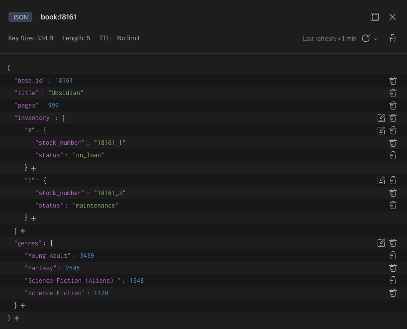

## Introducing RedisJSON
RedisJSON is a component within Redis Stack that allows the storage and manipulation of JSON documents within Redis. Once stored in Redis, individual or multiple properties can then be updated and retrieved and transformed from other operations similar to those expected from native Redis Data types.

RedisJSON allows users to store JSON at a single Redis key regardless of depth or child data types.  There are no additional keys or data structure mappings required. JSON document attributes can also be viewed and modified without retrieving the entire object - saving a lot of time and network bandwidth.

Here are some particular features of RedisJSON:
- Full support for the [JSON standard](https://json.org): JSON created and utilized by programming languages and their frameworks are natively stored in Redis
- A [JSONPath](https://goessner.net/articles/JsonPath/) syntax for selecting/updating elements inside documents: individual and multiple values can be selected and retrieved using the JSONPath syntax.
- Documents stored as binary data in a tree structure, allowing fast access to sub-elements
- Typed atomic operations for all JSON values types


## Commands
RedisJSON employs the standard `GET` and `SET` commands (prefixed with `JSON.`) to store and retrieve JSON documents in their partial or entire state.  Lists, Strings, objects (JSON sub-documents), and Numbers that exist within a JSON document all benefit from data-type specific commands native to RedisJSON.  


| JSON Commands| Number Commands | String Commands | Array Commands | Object Commands |
| - | - | - | - | - |
| [JSON.GET](https://redis.io/commands/json.GET) | [JSON.NUMINCRBY](https://redis.io/commands/json.NUMINCRBY/) | [JSON.STRAPPEND](https://redis.io/commands/json.STRAPPEND/) | [JSON.ARRINDEX](https://redis.io/commands/json.ARRINDEX/) | [JSON.OBJKEYS](https://redis.io/commands/json.OBJKEYS/)  |
| [JSON.SET](https://redis.io/commands/json.SET) | [JSON.NUMMULTBY](https://redis.io/commands/json.NUMMULTBY/) | [JSON.STRLEN](https://redis.io/commands/json.STRLEN/)   | [JSON.ARRINSERT](https://redis.io/commands/json.ARRINSERT/)      | [JSON.OBJLEN](https://redis.io/commands/json.OBJLEN/)   |
| [JSON.FORGET / JSON.DEL](https://redis.io/commands/json.FORGET/)   |   | [JSON.ARRLEN](https://redis.io/commands/json.ARRLEN/)  |   |
| [JSON.TYPE](https://redis.io/commands/json.TYPE/)  |   | [JSON.ARRPOP](https://redis.io/commands/json.ARRPOP/)  |   |
|   |   | [JSON.ARRTRIM](https://redis.io/commands/json.ARRTRIM/) |   |


## Coding Examples

Here is a simple JSON document used throughout this page:
```json
{
    "base_id": 18161,
    "title": "Obsidian",
    "pages": 999,
    "inventory": [
        {
            "stock_number": "18161_1",
            "status": "on_loan"
        },
        {
            "stock_number": "18161_3",
            "status": "maintenance"
        }
    ],
    "genres": {
        "Young Adult": 3439, 
        "Fantasy": 2545, 
        "Science Fiction (Aliens) ": 1648, 
        "Science Fiction": 1170
    }
}
```

## 1. Creating a RedisJSON Document


If you are using RedisInsight, you should see the resulting display when you navigate to `book/Keys/book:18161` in the key browser.
<br/><br/>

To create a new RedisJSON document, use the JSON.SET command:
```bash
> JSON.SET book:18161 $ '{"base_id": 18161,"title": "Obsidian","pages": 999,"inventory": [{"stock_number": "18161_1","status": "on_loan"},{"stock_number": "18161_3","status": "maintenance"}],"genres": {"Young Adult": 3439, "Fantasy": 2545, "Science Fiction (Aliens) ": 1648, "Science Fiction": 1170}}'
"OK"
```

Command Structure:
`<Command>` `<KeyName>` `<Path>` `<Value>`

| Position | Value      |
|----------|------------|
| Command  | `JSON.SET` |
| Key  | `book:18161`   | 
| Path | `$`            |
| Value  | `'{...}'`    |

Notice the dollar sign `$` after the key name and before the JSON string in single quotes. This represents the **root** level where the JSON Value will be stored. When storing a new RedisJSON document, it is advisable to always store at the root level with `$`. You would then treat the `$` as the starting point for accessing fields within the JSON document.
<hr/>

## 2. Setting a value within an existing RedisJSON Document
The command `JSON.SET` can be used to update existing values within a RedisJSON document. For example, since `$` is the root level of the document, `$.pages` would represent the `pages` field of the `book:18161` document. To change the number under `pages` from `999` to `1025` use this JSONPath syntax to navigate to the relevant field. 

```bash
> JSON.SET book:18161 $.pages 1025
"OK"
```

Command Structure:
`<Command>` `<Key>` `<Path>` `<Value>`

| Position | Value        |
|----------|--------------|
| Command  | `JSON.SET`   |
| Key      | `book:18161` | 
| Path     | `$.pages`    |
| Value    | `1025`       |

JSONPath Breakdown:
1. `$.pages` refers to the `pages` field within the JSON document

Navigating to embedded objects and lists is similar to using dot notation on objects with Javascript or square brackets with Python and Dictionaries.

### Set a field within an embedded object or list
To change the status of the first book in the inventory from `"on_loan"` to `"available"`, the JSONPath would be: `$.inventory[0].status`

Command Structure:
`<Command>` `<Key>` `<Path>` `<Value>`

| Position | Value               |
|----------|---------------------|
| Command  | `JSON.SET`          |
| Key  | `book:18161`            | 
| Path | `$.inventory[0].status` |
| Value  | `"available"`         |

JSONPath Breakdown:
1. `$.inventory` refers to the `inventory` list in the JSON document
2. `$.inventory[0]` selects the first element of the list
3. `$.inventory[0].status` selects the status field in the first element of the list

```bash
> JSON.SET book:18161 $.inventory[0].status '"available"'
"OK"
```

### Set multiple fields with one JSONPath Capture
With JSONPath notation, multiple paths can be selected with one JSONPath expression. To select all `status` fields within two levels below root, use two dots after the root: `$..status` Each dot represents a level of descent into the JSON document. Note that this would capture all `status` fields in both arrays and objects.

Command Structure:
`<Command>` `<Key>` `<Path>` `<Value>`

| Position | Value           |
|----------|-----------------|
| Command  | `JSON.SET`      |
| Key      | `book:18161`    | 
| Path     | `$..status`     |
| Value    | `"in_transfer"` |

JSONPath Breakdown:
1. `$..` refers to all fields available two levels descended from root
2. `$..status` captures all `status` fields that are two levels descended from root

```bash
> JSON.SET book:18161 $..status '"in_transfer"'
```
This command sets all `status` fields to `"in_transfer"` in `book:18161`